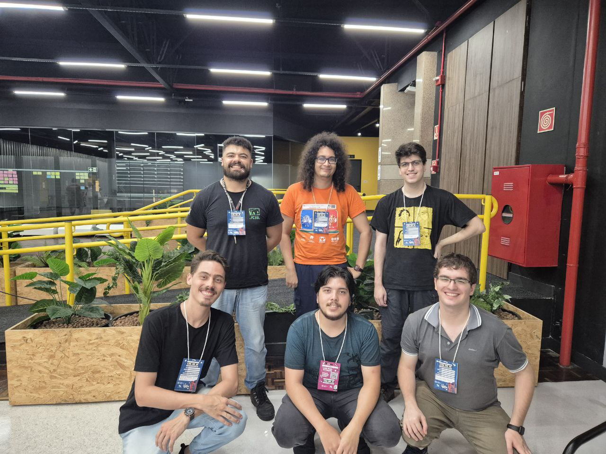

# Jogo-GGJ

The Global Game Jam® (GGJ) is a 501(c)(3) nonprofit registered in the state of California and our mission is to empower all individuals worldwide to learn, experiment, and create together through the medium of games in a safe and welcoming environment.

## Description

This project was developed during the Global Game Jam 2025, a worldwide event that brings together game developers to create games in a short period of time.

The event took place at PUCPR, in Curitiba, Brazil, from January 24 to January 26, 2025.

The theme of the event was "bubble".

## Team

<!-- In this section will briefly introduce the team members. -->
<!-- The main document will be the `docs/team.md` file. -->

Our team is composed of six members:

- [Anderson Frasão](docs/team.md#anderson-frasão)
- [Bruno Krugel](docs/team.md#bruno-krugel)
- [Bruno dal Pontte](docs/team.md#bruno-dal-pontte)
- [Fernando Kiotheka](docs/team.md#fernando-kiotheka)
- [Lucas Araujo](docs/team.md#lucas-araujo)
- [Muriki Gusmão](docs/team.md#muriki-gusmão)

We are all students from the Computer Science course at UFPR.

To know more about us, please check the [team.md](docs/team.md) file.

## Game

### Title

### Description

### Controls

### How to play

### Screenshots

## How to install

Instructions on how to run the game. For more detailed instructions, check the [install.md](docs/install.md) file.

### Requirements

### Instructions

## Credits

We have used some free assets in this project. The credits for they all are described in the [credits.md](docs/credits.md) file.

Go check it out to see how awesome these creators are!

## Special thanks

### Global Game Jam

### PUCPR

## License

This project is licensed under the MIT License - see the [LICENSE.md](LICENSE.md) file for details.
